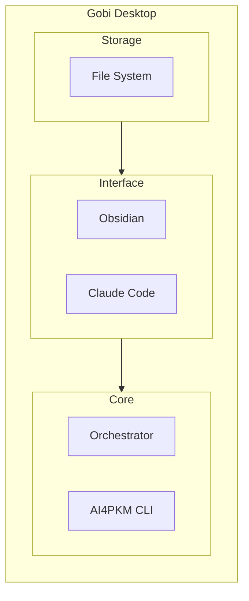

# AI4PKM Helper

This skill provides guidance for setting up and using AI4PKM (AI for Personal Knowledge Management). It helps beginners through onboarding, directs users to appropriate resources (Gobi Desktop, CLI, Orchestrator), and hands off to DDA (Daily Driver Agent) for ongoing daily use.

## AI4PKM Architecture



**3-tier model:**
- **Storage**: Markdown files (AI-optimal format)
- **Interface**: Obsidian for viewing/editing, Claude Code for AI interaction
- **Core**: Orchestrator for automation, CLI for quick commands
- **GUI**: Gobi Desktop wraps all above with visual interface

## Learning Path

| Stage | Target | Guide |
|-------|--------|-------|
| A. PKM 초보자 | 저장 습관 만들기 | Background reading |
| B. Obsidian 입문 | 마이그레이션 + 익숙해지기 | (1) 터미널 설치 가이드 |
| C. Claude Code 입문 | CLI Agent 설치 및 첫 대화 | (2) Gobi Desktop 가이드 |
| D. 고급 사용자 | 자동화 + 커스텀 워크플로우 | (4) Orchestrator 설정 |

## When to Use This Skill

Claude should automatically load this skill when:
- User requests "AI4PKM 시작" or "온보딩 시작"
- User asks about setting up AI4PKM or Obsidian vault
- User wants to configure orchestrator or workflows
- User needs help adding tasks or understanding AI4PKM concepts
- User is new to PKM and needs guided setup

## Quick Commands

```markdown
"AI4PKM 시작" / "온보딩 시작" → Start Onboarding Module
"Orchestrator 설정" → Orchestrator Setup Module
"태스크 추가" → Task Management Module
"도움말" → Show available modules and commands
```

## Core Modules

### Module 1: Onboarding (초보자 셋업)

**Purpose**: Guide complete beginners from zero to first journal entry

**Flow** (5 steps):
1. **Assessment**: Evaluate user level (3 simple questions)
2. **Setup Vault**: Create 6 essential folders + AGENTS_beginner.md
3. **Plugin Guide**: Install 3 must-have plugins (Templater, Calendar, Dataview)
4. **First Journal**: Create today's journal interactively
5. **AI Connection**: Verify Claude Code works → Handoff to DDA

**Prompts**:
- `AI4PKM - Onboarding - Step 1 - Assessment.md`
- `AI4PKM - Onboarding - Step 2 - Setup Vault.md`
- `AI4PKM - Onboarding - Step 4 - First Journal.md`
- `AI4PKM - Onboarding - Step 3 - Plugin Guide.md` (optional for MVP)
- `AI4PKM - Onboarding - Step 5 - AI Connection.md` (optional for MVP)

**Templates Used**:
- `AGENTS_beginner.md`: Simplified agent rules for beginners
- `daily_journal_template.md`: Daily journal template

**Handoff to DDA**:
After Step 5 completion:
- Congratulate user on completing onboarding
- Introduce DDA capabilities (daily briefing, journal help, schedule management)
- Run handoff prompt: `AI4PKM - Handoff to DDA.md`
- Activate DDA skill with user_level = "beginner"

### Module 2: Orchestrator Setup (워크플로우 자동화)

**Purpose**: Configure orchestrator.yaml for event-driven automation

→ **상세 가이드**: (4) Orchestrator 설정

**Key Concepts**:
- **Node**: Event-driven agent that triggers on file changes or schedules
- **Executor**: AI engine to run (claude_code, codex_cli, gemini_cli)
- **Poller**: External data sync (limitless, apple_photos, apple_notes)

**Setup Process**:
1. Explain orchestrator purpose and benefits
2. Show orchestrator.yaml structure (nodes, pollers, defaults)
3. Configure first agent (e.g., EIC - Enrich Ingested Content)
4. Test agent execution with file trigger

**Prompt**: `AI4PKM - Orchestrator Setup.md`

**Example Configuration** (current format):
```yaml
version: "1.0"

orchestrator:
  prompts_dir: _Settings_/Prompts
  tasks_dir: _Settings_/Tasks
  logs_dir: _Settings_/Logs
  skills_dir: _Settings_/Skills
  max_concurrent: 3
  poll_interval: 1

defaults:
  executor: claude_code
  timeout_minutes: 30
  max_parallel: 3
  task_create: true

nodes:
  - type: agent
    name: Enrich Ingested Content (EIC)
    input_path: Ingest/Clippings
    output_path: AI/Articles
    executor: claude_code

  - type: agent
    name: Meeting Conference Event (MCE)
    cron: "15,45 * * * *"
    input_path: AI/Events
    executor: claude_code
    agent_params:
      calendars:
        - Default
        - Work

pollers:
  limitless:
    enabled: true
    target_dir: "Ingest/Limitless"
    poll_interval: 300
```

**Node Types**:
| Type | Trigger | Example |
|------|---------|---------|
| File-triggered | New/updated file in input_path | EIC, GDR |
| Cron-scheduled | Time-based (cron expression) | MCE |

**설정 필드 참조**:

| 필드 | 설명 |
|------|------|
| `name` | Agent 이름 |
| `prompt` | 프롬프트 파일 참조 (ABBR) |
| `input_path` | 입력 디렉토리 |
| `output_path` | 출력 디렉토리 |
| `executor` | 실행 엔진 (claude_code, codex_cli) |
| `cron` | 스케줄 실행 (cron 표현식) |

### Module 3: Task Management (태스크 관리)

**Purpose**: Add, update, and track tasks in AI4PKM system

**Operations**:
- **Add Task**: Create new task with description, category, priority
- **Update Status**: Mark tasks as in_progress, completed, or blocked
- **View Tasks**: List tasks by status, category, or date

**Prompt**: `AI4PKM - Add Task.md`

**Task Categories**:
- 🔍 Research
- 📐 Design
- 🛠️ Implement
- ✍️ Write
- 📝 Docs & System

## Voice Mode Configuration

### Language Support
- Support both English and Korean
- Use `tts_model="gpt-4o-mini-tts"` for natural pronunciation
- Continue conversation naturally

### Listening Behavior
- **Patient listening**: Wait for user to finish (use `min_listen_duration=8`)
- **Adaptive waiting**: Don't interrupt incomplete thoughts
- Use `vad_aggressiveness=0` for permissive voice detection

### Progress Updates
- For long operations (10+ seconds), provide voice updates
  - "지금 폴더 생성 중이에요..." / "플러그인 확인하는 중입니다..."
- Keep user informed throughout process

## User Level Detection

### Assessment Questions (Step 1)
1. **Obsidian 경험**: "옵시디언 써보신 적 있으세요?"
   - 처음 / 들어봄 / 써봄 → beginner
   - 몇 달 사용 → intermediate
   - 1년+ 사용 → advanced

2. **PKM 목적**: "노트 관리를 왜 하고 싶으세요?"
   - 메모 정리 → beginner
   - 지식 체계화 → intermediate
   - 제2의 뇌 구축 → advanced

3. **기존 시스템**: "지금 어떻게 노트 관리하세요?"
   - 없음/종이 → beginner
   - Notion/Evernote → intermediate
   - 커스텀 시스템 → advanced

### Level-Based Features

| Level | Features | Approach |
|-------|----------|----------|
| Beginner | Onboarding only | Step-by-step guidance |
| Intermediate | Onboarding + Orchestrator | Brief explanations |
| Advanced | All modules | Direct to advanced features |

**Note**: MVP focuses on beginners only. Intermediate/advanced users can skip to specific modules.

## Community Feedback Integration

커뮤니티 피드백 기반 온보딩 원칙:

→ **피드백 소스**: [[AI/Events/2025-10-30 AI4PKM 커뮤니티 미팅 by Claude Code|커뮤니티 미팅]], [[Projects/AI4PKM/AI4PKM User Interview|User Interview]]

### 핵심 이슈와 대응 전략

| 이슈 | 문제 | 대응 |
|------|------|------|
| **개념적 혼란** | AI4PKM이 뭔지 모르겠음 | 첫 안내에서 "AI로 지식 관리" 간단 설명 |
| **기술적 장벽** | 터미널/CLI가 낯설음 | No-Code 경로 강조, Step 4 선택사항 |
| **백지 공포증** | 뭐부터 해야 할지 막막함 | Step 3에서 **저널 먼저** → 빠른 성취감 |
| **습관 형성** | 2-3주 후 이탈 | DDA Beginner Mode로 점진적 복잡도 |
| **비개발자 불안** | "따라갈 수 있을까" | 친근한 말투, 이모지, 격려 메시지 |

### PKM 근본적 질문 대응

**커뮤니티에서 제기된 질문들**:

1. **"정리만 하고 학습이 안 됨"**
   - 대응: Express 단계 강조 (Week 2+에서 창작/공유 소개)
   - CODE 사이클: Capture → Organize → Distill → **Express**

2. **"측정이 어려움"**
   - 대응: 작은 성취 체크리스트로 가시화
   - 예: "첫 저널 완성! 🎉", "7개 클리핑 달성!"

3. **"개인마다 니즈 다름"**
   - 대응: Assessment에서 맞춤형 경로 제공
   - 미래: Importer Guide로 기존 데이터 마이그레이션 지원

4. **"수집은 하는데 안 봄"**
   - 대응: Journal = Single Source of Truth로 통합
   - DDA가 매일 저널 기반으로 브리핑

### 비개발자 친화적 접근

**No-Code 경로** (터미널 없이 사용 가능):
- 웹 클리핑 → 자동 저장
- 일기 작성
- 토픽 인덱싱 (수동)
- 주간 라운드업 (수동 트리거)

**핵심 메시지**:
> "완벽하지 않아도 됩니다. 일단 시작하세요."
> "비개발자도 80%의 기능을 터미널 없이 사용할 수 있어요."

### 시간 가이드 (레벨별)

| 레벨 | 일일 시간 | 가능한 것 |
|------|----------|-----------|
| Level 1 | 5분 | 클리핑 + 일기 한 줄 |
| Level 2 | 15분 | + 토픽 정리 + AI 요약 |
| Level 3 | 30분+ | + 워크플로우 자동화 |

## Handoff to DDA Mechanism

### Trigger Conditions
- Onboarding Step 5 completed
- User confirms "준비 완료" or similar

### Handoff Process
1. **Congratulations Message**:
   ```
   축하합니다! AI4PKM 온보딩이 완료되었어요! 🎉

   이제부터는 제가 매일 여러분을 도와드릴게요.
   ```

2. **DDA Introduction**:
   - Daily briefing ("오늘 일정 어때?")
   - Journal help ("오늘 목표 뭐야?")
   - Schedule management ("내일 3시에 미팅 추가")
   - Thought organization ("이거 어떻게 생각해?")

3. **First Interaction Example**:
   ```
   "오늘 일정 알려줘" 같은 거요.
   편하게 말씀해주세요!
   ```

4. **Skill Transition**:
   - Run handoff prompt
   - Pass user_level = "beginner" to DDA
   - Activate DDA skill
   - Continue conversation context

### Information Passed to DDA
```yaml
handoff_data:
  user_level: beginner
  completed_steps: [1, 2, 3, 4, 5]
  vault_path: /path/to/vault
  first_journal_date: 2025-12-10
  preferred_mode: voice  # or text
```

## DDA Beginner Mode (신규)

When DDA receives `user_level: beginner`:

### Simplified Commands
- "오늘 일정 알려줘" → Journal Schedules
- "목표 추가해줘" → Interactive goal addition
- "저널 쓰기 도와줘" → Guided journal writing
- "미팅 추가" → Interactive schedule addition

### Gradual Complexity Introduction

| Week | Introduce | Example |
|------|-----------|---------|
| Week 1 | Basic commands only | Goals, Schedules, Notes |
| Week 2 | Workflow concepts | "DIR 실행해줘" (with explanation) |
| Week 3+ | Automation | Background Tasks, MCE/PLL/DDC |

### Behavioral Changes
- **Simpler explanations**: Avoid technical jargon
- **More guidance**: Suggest next actions
- **Less automation**: Confirm before auto-processing
- **Encouraging tone**: Celebrate small wins

## Example Interactions

### Starting Onboarding
```
User: AI4PKM 시작
Agent: AI4PKM에 오신 걸 환영합니다! 🎉
        먼저 몇 가지만 여쭤볼게요.
        옵시디언 써보신 적 있으세요?
User: 처음이에요
Agent: 좋아요! 처음부터 차근차근 안내해드릴게요.
       [Step 1 프롬프트 실행]
```

### Completing Onboarding
```
Agent: 축하합니다! 첫 저널도 만들었고, AI 연동도 확인했어요! ✅
       이제부터는 매일 제가 도와드릴게요.

       저는 이렇게 도울 수 있어요:
       - 매일 아침 브리핑 ("오늘 일정 어때?")
       - 저널 작성 도움 ("오늘 목표 뭐야?")
       - 일정 추가/확인 ("내일 3시에 미팅 추가")

       편하게 말씀해주세요! "오늘 일정 알려줘" 같은 거요.

       [DDA 활성화]
```

### First DDA Interaction (Beginner Mode)
```
User: 오늘 일정 알려줘
DDA: [Journal 확인]
     오늘은 일정이 없네요! 편하게 목표에 집중하실 수 있겠어요.

     오늘 목표는:
     - AI4PKM 익숙해지기

     뭐 하고 싶으신 게 있으세요?
```

## Implementation Notes

### Prompt Chaining
Each prompt is independent but connected:
- **Input**: Previous step's output (optional)
- **Process**: Execute current step
- **Output**: Results for next step

### Semi-Automatic Execution
- Each step requires user confirmation
- Keywords: "완료", "다음", "계속" → proceed
- Keywords: "중단", "나중에" → pause
- User can resume from any step

### Error Handling
- Clear error messages in Korean
- Suggest fixes or alternatives
- Allow retry or skip (when safe)
- Never leave user stuck

## Files Structure

```
_Settings_/Skills/ai4pkm-helper/
├── SKILL.md                    # This file
└── modules/                    # (Future: detailed module guides)
    ├── onboarding.md
    ├── orchestrator.md
    └── tasks.md

_Settings_/Prompts/
├── AI4PKM - Onboarding - Step 1 - Assessment.md
├── AI4PKM - Onboarding - Step 2 - Setup Vault.md
├── AI4PKM - Onboarding - Step 4 - First Journal.md
├── AI4PKM - Handoff to DDA.md
└── ...

_Settings_/Templates/
├── AGENTS_beginner.md
├── daily_journal_template.md
└── orchestrator_template.yaml
```

## References

### AI4BM Theory Documents
- [Second Brain Concept](obsidian://open?vault=AI4BM&file=Theory/Concepts/Second%20Brain)
- [PKM Framework](obsidian://open?vault=AI4BM&file=Theory/Concepts/PKM%20Framework)
- [AI4PKM Theory Series](obsidian://open?vault=AI4BM&file=Theory/AI4PKM/Overview)

### Related Skills
- **Daily Driver Agent (DDA)**: `_Settings_/Skills/daily-driver-agent/SKILL.md`
  - Handles daily operations after onboarding
  - Beginner Mode for new users

### Design Documents
- `[[AI/Analysis/2025-12-10 AI4PKM Onboarding Agent Design - Claude Code]]`
  - Original 4-week design (comprehensive reference)

## Troubleshooting

### Common Issues

**"폴더가 이미 있어요"**
→ 괜찮습니다! 기존 파일은 건드리지 않고 필요한 것만 추가할게요.

**"플러그인 설치가 안 돼요"**
→ Obsidian 설정 → 커뮤니티 플러그인 → "제한 모드 해제" 확인해주세요.

**"저널 템플릿이 안 보여요"**
→ Templater 플러그인 설정에서 템플릿 폴더를 `_Settings_/Templates`로 지정해주세요.

**"음성 모드가 안 돼요"**
→ 텍스트로도 괜찮아요! 음성은 선택 사항입니다.

## Future Enhancements

### Post-MVP (v1.1+)
- Notion migration assistant
- Best practices guide module
- Advanced workflow configuration
- Habit tracking integration
- Community resource links

### Long-term Vision
- Multi-vault setup support
- Team collaboration setup
- Custom workflow builder
- Performance analytics
- Mobile setup guide

## Success Criteria

### Onboarding Success
- [ ] User completes all 5 steps within 30 minutes
- [ ] Vault structure created correctly
- [ ] First journal entry exists
- [ ] User can interact with DDA naturally

### Handoff Success
- [ ] User understands DDA capabilities
- [ ] First DDA interaction is successful
- [ ] User feels confident to continue daily use
- [ ] Beginner Mode activated properly

## Notes

- **Focus on simplicity**: MVP for beginners only
- **Voice-friendly**: Design for conversational interaction
- **Quick wins**: Each step provides immediate value
- **Smooth handoff**: Seamless transition to DDA
- **Gradual learning**: Don't overwhelm with features
