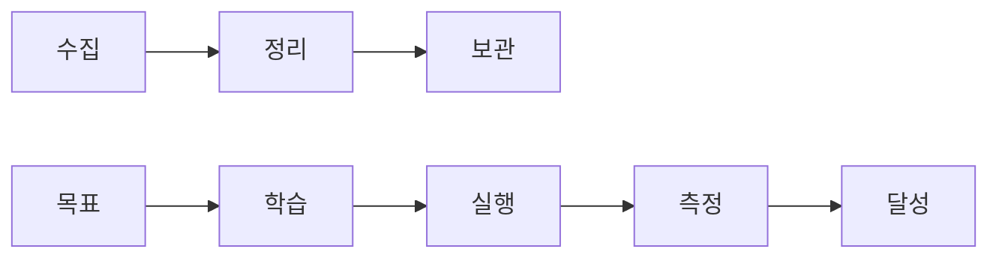
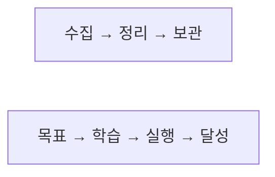
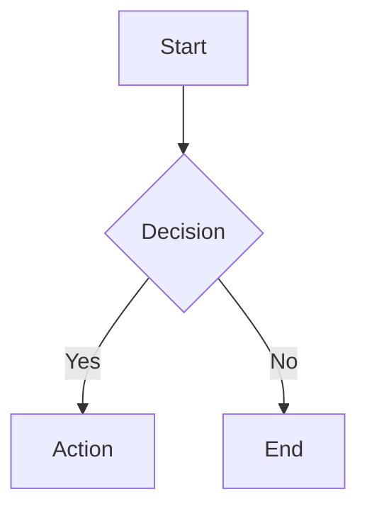
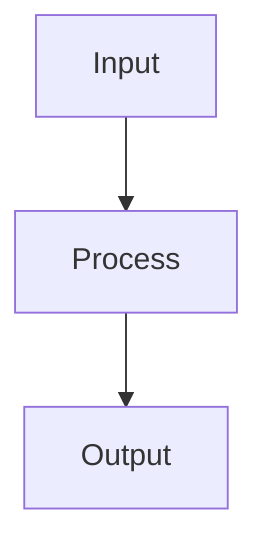
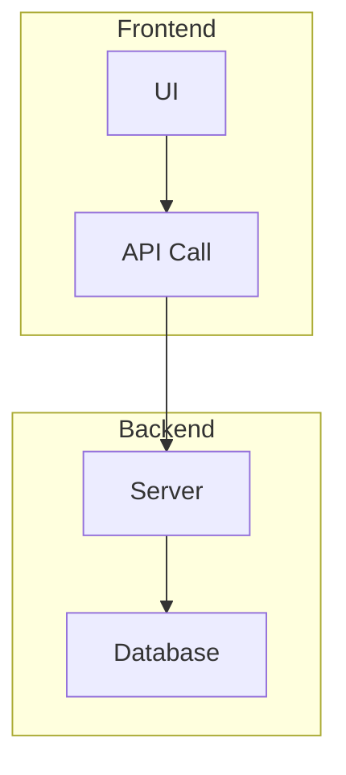
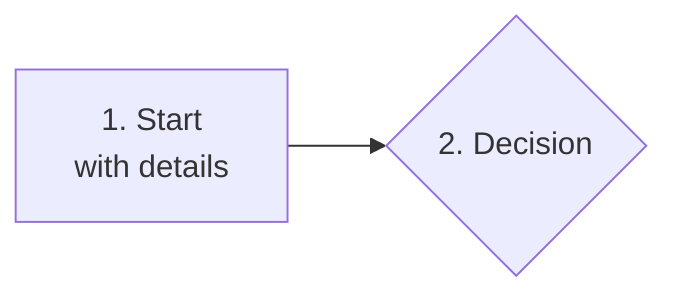
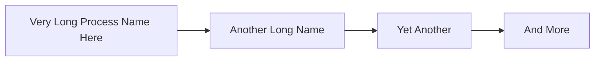
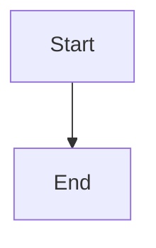

# Obsidian Mermaid Diagrams

Create Mermaid diagrams that render correctly in Obsidian and publish without issues.

## When to Use This Skill

Activate when you need to:
- Create flowcharts, sequence diagrams, ER diagrams
- Convert ASCII art to Mermaid
- Fix Mermaid rendering errors in Obsidian

## Core Principle: Simplicity First

> **다이어그램은 한눈에 들어와야 한다**

복잡한 다이어그램은 읽기 어렵다. 항상 최소한의 노드와 연결로 핵심만 표현하라.

### Node Minimization

**Before** (9개 노드):


**After** (2개 노드 - 순차 흐름을 노드 내 텍스트로):


### Connection Minimization

- 핵심 흐름만 표현, 세부사항은 본문에서 설명
- 노드 5개 이하, 연결선 교차 금지
- 복잡한 관계는 여러 개의 단순한 다이어그램으로 분리

### Table vs Mermaid 선택

| 형식 | 용도 | 예시 |
|------|------|------|
| **테이블** | 속성-값 매핑, 비교, 옵션 | 에너지 레벨별 작업 |
| **Mermaid** | 흐름, 프로세스, 피드백 루프 | 입력→처리→출력 |
| **인라인** | 단순 순차 흐름 | `A → B → C` |

**원칙**: 같은 정보를 더 컴팩트하게 표현하는 형식 선택

---

## Critical Rules

### 1. NO Markdown in Labels

**Common Errors**:
```
Node["1. First"]     → "Unsupported markdown: list"
Node["Text<br/>More"] → "Unsupported markdown: heading"
Node["## Header"]    → "Unsupported markdown: heading"
```

**Correct**:
```
Node[First]
Node[Text]
```

**Rule**: Keep labels plain text. Move complex descriptions outside the diagram.

### 2. Use TB Direction (Narrow Width)

**Problem**: `flowchart LR` (left-right) creates wide diagrams that get cut off when published.

```markdown
❌ Gets cut off:
flowchart LR

✅ Fits narrow screens:
flowchart TB
```

**Rule**: Default to `flowchart TB` (top-bottom) unless horizontal layout is essential.

### 3. Keep Labels Short

```markdown
❌ Too long:
Node["This is a very long description that will break layout"]

✅ Short and clear:
Node[Short Label]
```

**Rule**: Labels should be under 15 characters. Add details in text below the diagram.

### 4. Avoid Special Characters in Subgraph Names

```markdown
❌ May cause issues:
subgraph "1. Phase One"
subgraph "Phase: Setup"

✅ Safe:
subgraph Phase_One["Phase One"]
subgraph Setup["Setup Phase"]
```

## Good Examples

### Simple Flowchart


### Process Flow with Details Outside


**Process Details**:
- Input: User data from form
- Process: Validation and transformation
- Output: Saved to database

### Subgraph Example


## Bad Examples (Don't Do This)

### Markdown in Labels

This will show "Unsupported markdown" errors.

### Too Wide

This gets cut off on mobile and narrow screens.

## Converting ASCII to Mermaid

**ASCII Art**:
```
┌───────┐     ┌───────┐
│ Start │────→│  End  │
└───────┘     └───────┘
```

**Mermaid**:


## Quality Checklist

Before completing diagram creation:

- [ ] No `<br/>` tags in node labels
- [ ] No numbered list format (`1.`, `2.`) in labels
- [ ] Using `flowchart TB` direction (not LR)
- [ ] All labels are short (under 15 characters)
- [ ] Complex details moved to text outside diagram
- [ ] No special characters in subgraph names
- [ ] Tested rendering in Obsidian preview
