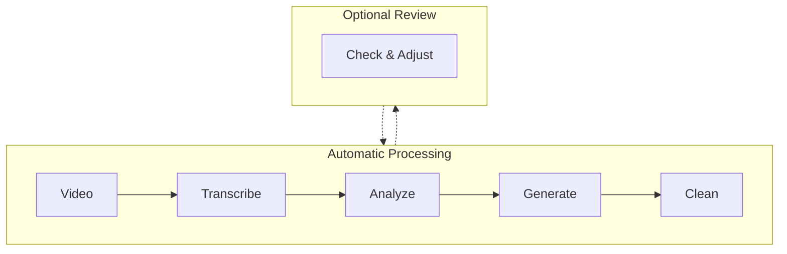

# video-add-chapters

Transcribe videos using Whisper API, automatically detect chapter boundaries, and generate structured markdown documents with YouTube chapter markers.

## When to Use This Skill

- Transcribing long videos (20+ minutes) and splitting into chapters
- Converting video transcripts into structured documentation
- Generating YouTube chapter markers for video descriptions
- Cleaning up raw transcripts into readable documents

## Example Results

- **Live Example**: [AI4PKM W2 Tutorial Part 1](https://pub.aiforbetter.me/community/2026-01-cohort/2026-01-14-ai-4-pkm-w2-tutorial-part-1/)
- See `examples/` folder for sample outputs

## Requirements

### System
- Python 3.7+
- FFmpeg (for audio extraction)

### Python Packages
```bash
pip install -r requirements.txt
```

### Environment Variables
- `OPENAI_API_KEY` - Required for Whisper API

## How It Works



All steps run automatically without user intervention. Optional review step available if manual adjustment is needed.

## Usage

### Quick Start (Automated Pipeline)
```bash
# Run all steps automatically
python transcribe_video.py "video.mp4" --language ko --output-dir "./output"
python suggest_chapters.py "video.mp4" --output "chapters.json"
python generate_docs.py "video.mp4" --chapters "chapters.json" --output-dir "./output"
python clean_transcript.py "./output/merged_document.md" --backup
```

### Step-by-Step Details

**1. Transcribe Video**
```bash
python transcribe_video.py "video.mp4" --language ko --output-dir "./output"
```
- Splits video into 15-minute chunks
- Transcribes using Whisper API
- Handles timestamp offsets automatically
- Output: `{video} - transcript.json`

**2. Detect Chapter Boundaries**
```bash
python suggest_chapters.py "video.mp4" --output "chapters.json"
```
- Analyzes transcript for topic transitions
- Uses transition signal patterns (not pauses)
- Output: `chapters.json` with suggested boundaries

**3. Generate Documents**
```bash
python generate_docs.py "video.mp4" --chapters "chapters.json" --output-dir "./output"
```
- Creates individual chapter markdown files
- Generates merged document and index
- Outputs YouTube chapter markers

**4. Clean Transcript**
```bash
python clean_transcript.py "./output/merged_document.md" --backup
```
- Removes filler words
- Improves sentence structure
- Enhances paragraph cohesion
- Preserves timestamps and chapter boundaries

### Optional: Manual Review
If chapter boundaries need adjustment:
1. Edit `chapters.json` with corrected timestamps
2. Re-run `generate_docs.py` to regenerate documents

## File Structure

```
video-add-chapters/
├── SKILL.md                    # This document
├── requirements.txt            # Python dependencies
├── transcribe_video.py         # Step 1: Video → Transcript
├── suggest_chapters.py         # Step 2: Chapter boundary detection
├── generate_docs.py            # Step 2: Document generation
├── clean_transcript.py         # Step 4: Transcript cleaning
├── templates/                  # Markdown templates
│   ├── chapter.md
│   ├── index.md
│   └── youtube_chapters.txt
└── examples/                   # Sample outputs
    ├── sample_chapter.md
    └── sample_youtube_chapters.txt
```

## Troubleshooting

| Issue | Cause | Solution |
|-------|-------|----------|
| Chapter boundaries don't match content | Boundary set at keyword first mention | Use transition signal patterns for boundaries |
| Merged document content mismatch | Manual updates missed in separate files | Update all related files when changing boundaries |
| Transcript timing seems off | Misdiagnosed as offset issue | Verify: Whisper timestamps = video timestamps (no offset) |
| Chapter content overlap | Boundary doesn't match content transition | Use end signals for endpoints, start signals for start points |

### Verification Checklist

1. [ ] Verify video timestamp at each chapter start
2. [ ] Confirm next chapter content doesn't start before current chapter ends
3. [ ] Check merged document body matches chapter boundaries
4. [ ] Test YouTube link timestamps are accurate
5. [ ] Verify original meaning is preserved after cleaning

## Language Support

Currently optimized for **Korean** language with hardcoded transition patterns. Multi-language support: **TBA**.

## Cost Estimate

Whisper API pricing: ~$0.006 per minute of audio
- 1-hour video: ~$0.36
- Processing is done in 15-minute chunks

## Integration

- **shorts-extraction**: Extract chapters as short-form clips
- **youtube-transcript**: Download YouTube video transcripts

## Reference: CHAPTERS Array Format

```python
# Format: (start_seconds, title, description)
CHAPTERS = [
    (0, "Intro", "Introduction and welcome"),
    (98, "Setup", "Environment setup guide"),
    (420, "Main Content", "Core tutorial content"),
    # ... each chapter's start time, title, description
]
```
