# Video Cleaning Skill

Automated video transcription and editing workflow that removes pauses and filler words from Korean videos using OpenAI Whisper API and MoviePy for frame-accurate cuts.

## When to Use This Skill

Use this skill when you need to:
- Clean up recorded presentations or talks
- Remove awkward pauses and "uh/um" sounds from videos
- Reduce video length by removing dead air
- Create polished videos from raw recordings
- Process Korean language videos with natural speech patterns

**Perfect for**: Presentation recordings, lecture videos, podcast recordings, interview footage, or any speaking video that needs cleaning.

## Example Results

See the before/after comparison:
- **Before**: https://youtu.be/2jfRBlQ4veI (1:13 original)
- **After**: https://youtu.be/ZTsFZs9w65M (0:45 edited, 39% reduction)

## Requirements

### System Requirements
- **FFmpeg**: Video processing tool (must be installed)
  - macOS: `brew install ffmpeg`
  - Linux: `sudo apt install ffmpeg`
  - Windows: Download from [ffmpeg.org](https://ffmpeg.org/)

### Python Requirements
- **OpenAI Python SDK**: `pip install openai`
- **MoviePy**: `pip install moviepy` (video editing with frame accuracy)
- **OpenAI API Key**: Set environment variable `OPENAI_API_KEY`
  - Get your API key from [platform.openai.com](https://platform.openai.com/)
  - Cost: ~$0.15 per 25-minute video (Whisper transcription)

### Python Version
- Python 3.7 or higher

## How It Works

This skill uses a **two-step workflow**:

### Step 1: Transcription (`transcribe_video.py`)
1. Extracts audio from video using FFmpeg
2. Sends audio to OpenAI Whisper API for transcription
3. Receives word-level timestamps (precise timing for each word)
4. Generates three output files:
   - `{video_name} - transcript.json` (complete API response)
   - `{video_name} - transcript.md` (formatted markdown)
   - `{video_name} - word_timings.txt` (simple text reference)

### Step 2: Video Editing (`edit_video_remove_pauses.py`)
1. Loads word-level transcript from Step 1
2. Identifies long pauses between words (> 1.0 seconds by default)
3. Identifies Korean filler words (어, 음, 아, 이, 오, 저)
4. Calculates which video segments to keep
5. Uses MoviePy for frame-accurate cutting and reassembly
6. Generates edited video and detailed report

## Conservative Editing Philosophy

This skill uses **conservative editing** to ensure safe, predictable results:

### What Gets Removed
- ✅ **Long pauses** (>1.0 seconds of silence between words)
- ✅ **Clear filler words**: 어, 음, 아, 이, 오, 저 (Korean equivalents of "uh", "um", "ah", etc.)

### What Gets Kept
- ✅ **Context-dependent words**: 이제, 뭐, 그, 좀, 네, 약간
  - These words can be legitimate in Korean speech
  - Removing them risks cutting meaningful content
- ✅ **Short pauses** (< 1.0 seconds)
  - Natural breathing and thinking pauses
  - Important for speech rhythm

### Expected Results
- **Time saved**: 5-10% typically (1-2 minutes per 25-minute video)
- **Video segments**: 50-100 cuts (manageable, smooth transitions)
- **Safety**: Very low risk of removing important content
- **Quality**: Natural-sounding edited video

## Usage Guide

### Basic Workflow

```bash
# Step 1: Transcribe your video
python transcribe_video.py "my_presentation.mp4"

# Step 2: Preview what will be removed
python edit_video_remove_pauses.py "my_presentation.mp4" --preview

# Step 3: Create edited video
python edit_video_remove_pauses.py "my_presentation.mp4"
```

### Step 1: Transcription Options

```bash
# Basic transcription (Korean, default)
python transcribe_video.py "video.mp4"

# Custom output directory
python transcribe_video.py "video.mp4" --output-dir "transcripts"

# Keep extracted audio file
python transcribe_video.py "video.mp4" --keep-audio

# English transcription
python transcribe_video.py "video_en.mp4" --language "en"
```

**Transcription outputs** (auto-generated in same directory as video):
- `video - transcript.json` (464 KB for 25-min video, ~2,800 words)
- `video - transcript.md` (formatted with timestamps)
- `video - word_timings.txt` (simple reference)

### Step 2: Video Editing Options

```bash
# Preview mode (see what will be removed)
python edit_video_remove_pauses.py "video.mp4" --preview

# Basic editing (default settings)
python edit_video_remove_pauses.py "video.mp4"

# Custom pause threshold (remove pauses > 0.8 seconds)
python edit_video_remove_pauses.py "video.mp4" --pause-threshold 0.8

# Custom output path
python edit_video_remove_pauses.py "video.mp4" --output "cleaned_video.mp4"

# Adjust padding around cuts (default: 0.1 seconds)
python edit_video_remove_pauses.py "video.mp4" --padding 0.15

# Specify transcript location (if not auto-detected)
python edit_video_remove_pauses.py "video.mp4" --transcript "path/to/transcript.json"

# Skip filler word removal (only remove pauses)
python edit_video_remove_pauses.py "video.mp4" --no-fillers

# Save pauses data for chapter remapping (used by video-full-process)
python edit_video_remove_pauses.py "video.mp4" --output-pauses "video - pauses.json"
```

**Editing outputs**:
- `video - edited.mov` (cleaned video)
- `video - edited_edit_report.txt` (detailed report)

## Understanding the Edit Report

After editing, you'll receive a detailed report showing exactly what was removed:

```
============================================================
VIDEO EDIT REPORT (Conservative Mode)
============================================================

SUMMARY
------------------------------------------------------------
Original Duration:  00:25:21.000
Edited Duration:    00:23:16.690
Time Saved:         00:02:04.310 (8.2%)
Segments Kept:      67

PAUSES REMOVED
------------------------------------------------------------
Total Pauses:       43
Total Pause Time:   87.81 seconds

Top 10 Longest Pauses:
   1.  5.64s at 00:07:51.500
   2.  5.52s at 00:09:21.020
   3.  3.54s at 00:00:11.520
   ...

FILLER WORDS REMOVED (Clear Fillers Only)
------------------------------------------------------------
Total Fillers:      28
Breakdown:
  어     :  25 occurrences
  아     :   3 occurrences

SAMPLE EDITS (First 5)
------------------------------------------------------------
  1. Pause (3.54s) at 00:00:11.520
  2. Pause (1.50s) at 00:00:29.400
  3. Filler '어' (0.84s) at 00:05:32.140
  ...
```

## Advanced Usage

### Custom Pause Thresholds

Adjust based on your content:

```bash
# More aggressive pause removal (0.8 seconds)
python edit_video_remove_pauses.py "video.mp4" --pause-threshold 0.8

# Very conservative (only remove 2+ second pauses)
python edit_video_remove_pauses.py "video.mp4" --pause-threshold 2.0
```

**Guidelines**:
- **0.5-0.8s**: Aggressive, removes more pauses but may feel rushed
- **1.0s** (default): Balanced, removes awkward pauses while keeping natural rhythm
- **1.5-2.0s**: Very conservative, only removes obvious dead air

### Batch Processing Multiple Videos

```bash
# Process all videos in a directory
for video in *.mp4; do
    echo "Processing: $video"
    python transcribe_video.py "$video"
    python edit_video_remove_pauses.py "$video"
done
```

### Preview Before Editing

Always preview first when working with important content:

```bash
# Step 1: Transcribe
python transcribe_video.py "important_presentation.mp4"

# Step 2: Preview edits
python edit_video_remove_pauses.py "important_presentation.mp4" --preview

# Step 3: If satisfied, execute
python edit_video_remove_pauses.py "important_presentation.mp4"
```

## File Naming Conventions

The scripts follow consistent naming patterns:

**Input**:
- `presentation.mp4` (your original video)

**Transcription outputs**:
- `presentation - transcript.json` (complete data)
- `presentation - transcript.md` (formatted markdown)
- `presentation - word_timings.txt` (simple reference)

**Editing outputs**:
- `presentation - edited.mov` (cleaned video)
- `presentation - edited_edit_report.txt` (detailed report)

## Technical Details

### MoviePy Processing

The editing script uses MoviePy for **frame-accurate cutting**:
- ✅ **Precise**: Cuts at exact timestamps, not keyframe boundaries
- ✅ **Accurate**: No ±1-2 second drift from keyframe limitations
- ✅ **Quality**: Re-encodes with libx264/AAC for consistent output
- ⚠️ **Slower**: Re-encoding takes more time than codec copy (worth it for accuracy)

### Minimum Segment Duration

Segments shorter than **0.1 seconds** are automatically filtered out:
- Prevents FFmpeg errors
- Avoids meaningless micro-cuts
- Ensures smooth playback

### Word-Level Timestamp Precision

Whisper API provides timestamps accurate to ~0.01 seconds:
- Precise enough for clean cuts between words
- Allows surgical removal of specific words
- Enables accurate pause detection

### Cut Parameters: padding & tail_buffer

두 파라미터는 컷 지점의 정확도를 조절합니다. Whisper 타임스탬프가 완벽하지 않기 때문에 버퍼가 필요합니다.

```mermaid
gantt
    title 원본 오디오 타임라인
    dateFormat X
    axisFormat %s

    section 원본
    단어 A          :a, 0, 2
    휴지 (침묵)      :crit, pause, 2, 5
    단어 B          :b, 5, 8
```



```mermaid
flowchart LR
    subgraph 원본["원본 오디오"]
        direction LR
        A["🗣️ 단어 A<br/>0-2초"]
        P["🔇 휴지<br/>2-5초"]
        B["🗣️ 단어 B<br/>5-8초"]
        A --> P --> B
    end
```



```mermaid
flowchart TB
    subgraph params["파라미터 작동 원리"]
        direction TB

        subgraph timeline["타임라인 (초)"]
            direction LR
            t0["0"] ~~~ t2["2"] ~~~ t5["5"] ~~~ t8["8"]
        end

        subgraph original["원본"]
            direction LR
            wordA["단어 A<br/>0~2초"]
            pause["휴지<br/>2~5초"]
            wordB["단어 B<br/>5~8초"]
            wordA --> pause --> wordB
        end

        subgraph cuts["컷 포인트"]
            direction LR
            tail["◀── tail_buffer<br/>휴지 시작점을<br/>0.15초 뒤로 연장"]
            pad["padding ──▶<br/>휴지 끝점에서<br/>0.1초 건너뜀"]
        end

        subgraph result["편집 결과"]
            direction LR
            keepA["✅ 유지: 0 ~ 2.15초<br/>(단어A + tail_buffer)"]
            remove["❌ 제거: 2.15 ~ 5.1초"]
            keepB["✅ 유지: 5.1 ~ 8초<br/>(padding 후 단어B)"]
            keepA --> remove --> keepB
        end
    end

    style pause fill:#ffcccc
    style remove fill:#ffcccc
    style keepA fill:#ccffcc
    style keepB fill:#ccffcc
```

**파라미터 요약:**

| 파라미터 | 기본값 | 역할 | 값을 늘리면 |
|---------|--------|------|------------|
| `--tail-buffer` | 0.15초 | 휴지 **시작 전** 음성 보존 | 단어 끝부분 더 보존 |
| `--padding` | 0.10초 | 휴지 **끝난 후** 건너뜀 | 더 많이 잘림 |

**음성이 잘리는 경우:**
- 단어 끝이 잘림 → `--tail-buffer` 증가 (예: 0.25)
- 단어 시작이 잘림 → `--padding` 감소 (예: 0.05)

## Troubleshooting

### "Transcript not found" Error

```
Error: Transcript not found: video - transcript.json
```

**Solution**: Run transcription first or specify transcript location:
```bash
python transcribe_video.py "video.mp4"
# OR
python edit_video_remove_pauses.py "video.mp4" --transcript "path/to/transcript.json"
```

### "No word-level data found" Error

**Solution**: Transcript JSON is incomplete or corrupted. Re-run transcription:
```bash
python transcribe_video.py "video.mp4"
```

### FFmpeg Not Found

```
Error: ffmpeg not found
```

**Solution**: Install FFmpeg:
- macOS: `brew install ffmpeg`
- Linux: `sudo apt install ffmpeg`
- Windows: Download from [ffmpeg.org](https://ffmpeg.org/)

### OpenAI API Key Missing

```
Error: OPENAI_API_KEY environment variable not set
```

**Solution**: Set your API key:
```bash
export OPENAI_API_KEY="sk-..."  # Add to ~/.bashrc or ~/.zshrc
```

### Edited Video Duration Mismatch

With MoviePy frame-accurate editing:
- Duration should match calculated time very closely
- If significantly different, check transcript timestamps
- Re-run transcription if timestamps seem off

### Video Quality Issues

If you notice quality degradation:
- Verify original video quality is good
- MoviePy uses libx264/AAC encoding with `preset=fast`
- For higher quality, modify script to use `preset=slow`

## Performance Characteristics

### Transcription (Step 1)
- **Speed**: ~1-2 minutes for 25-minute video
- **Cost**: ~$0.15 per 25 minutes (OpenAI Whisper pricing)
- **Output size**: ~500 KB JSON for 25-minute video

### Editing (Step 2)
- **Speed**: ~5-10 minutes for 25-minute video (re-encoding)
- **CPU usage**: High during encoding (uses 4 threads by default)
- **Disk space**: ~1.5x original video size during processing
- **Output quality**: High (libx264 + AAC encoding)

### Expected Time Savings

Based on typical Korean presentation videos:
- **Conservative mode**: 5-10% reduction (1-2 minutes per 25-minute video)
- **Longer pauses**: Can save 10-15% if speaker has many long pauses
- **Professional speakers**: May save less (3-5%) due to fewer pauses

## Example Workflow

Here's a complete example from start to finish:

```bash
# 1. You have a recorded presentation
ls
# presentation.mp4 (25:21 duration)

# 2. Transcribe the video
python transcribe_video.py "presentation.mp4"
# Output: Found 2,835 words
# Cost: $0.15
# Files created:
#   - presentation - transcript.json
#   - presentation - transcript.md
#   - presentation - word_timings.txt

# 3. Preview what will be removed
python edit_video_remove_pauses.py "presentation.mp4" --preview
# Found 43 pauses > 1.0s
# Found 28 filler word instances
# Video will be split into 67 segments
# Time saved: 00:02:04 (8.2%)

# 4. Looks good! Create edited video
python edit_video_remove_pauses.py "presentation.mp4"
# Cutting video segments... (3 minutes)
# Concatenating segments... (1 minute)
# ✅ Success! Edited video saved to: presentation - edited.mov

# 5. Review the results
ls
# presentation.mp4                          (original)
# presentation - edited.mov                 (cleaned, 23:17)
# presentation - edited_edit_report.txt     (detailed report)
# presentation - transcript.json
# presentation - transcript.md
# presentation - word_timings.txt
```

## Best Practices

### 1. Always Preview First
```bash
python edit_video_remove_pauses.py "video.mp4" --preview
```
Review the report before committing to editing.

### 2. Keep Original Files
Never delete your original video until you've verified the edited version.

### 3. Test Threshold Settings
Try different `--pause-threshold` values on a test video to find what works best for your content.

### 4. Check Audio Quality
Ensure audio is clear before transcription. Whisper works best with:
- Clear speech (not too fast or mumbled)
- Minimal background noise
- Good microphone quality

### 5. Batch Process Wisely
For multiple videos, process one completely first to verify settings, then batch the rest.

## Limitations

### What This Skill Cannot Do
- ❌ Remove background noise or improve audio quality
- ❌ Fix video quality issues
- ❌ Remove visual distractions or objects
- ❌ Auto-detect and remove specific speakers
- ❌ Add subtitles or captions (use transcript for this separately)

### Language Support
- ✅ **Optimized for Korean**: Filler word detection is Korean-specific
- ⚠️ **English**: Works for pauses, but filler words need adjustment
- ⚠️ **Other languages**: Transcription works, but filler detection needs customization

### Video Format Compatibility
- ✅ **Tested**: MP4, MOV, AVI, MKV
- ✅ **Output**: MOV format (universally compatible)
- ⚠️ **Codecs**: Best with H.264/AAC, may have issues with exotic codecs

## Cost Breakdown

### OpenAI Whisper API Costs
- **Pricing**: $0.006 per minute of audio
- **Examples**:
  - 25-minute video: $0.15
  - 1-hour video: $0.36
  - 10 videos (25 min each): $1.50

### Computing Costs
- **Transcription**: Minimal (API call only)
- **Editing**: Minimal (local FFmpeg processing)
- **Storage**: ~500 KB per 25-minute video (transcript JSON)

**Total cost per video**: Primarily OpenAI API fees (~$0.006/minute)

## Integration with video-add-chapters

This skill can be combined with `video-add-chapters` for a complete video processing workflow. Use the `video-full-process` skill for an automated pipeline:

```bash
# Full processing with transcript reuse
python process_video.py "video.mp4" --language ko
```

The `--output-pauses` flag exports pause data in JSON format for chapter timestamp remapping:

```json
{
  "pauses": [
    {"start": 45.2, "end": 48.5, "duration": 3.3},
    {"start": 120.1, "end": 125.8, "duration": 5.7}
  ],
  "total_pause_time": 87.5
}
```

This data enables accurate chapter remapping after pauses are removed.

## Support & Updates

### Getting Help
- Check error messages in the edit report
- Review troubleshooting section above
- Verify FFmpeg installation: `ffmpeg -version`
- Verify OpenAI API key: `echo $OPENAI_API_KEY`

### Skill Location
```
_Settings_/Skills/video-cleaning/
├── SKILL.md                          # This documentation
├── README.md                         # Quick reference
├── transcribe_video.py               # Step 1: Transcription
└── edit_video_remove_pauses.py       # Step 2: Editing
```

### Version History
- **v2.0** (2026-01): MoviePy migration for frame accuracy
  - Replaced FFmpeg codec-copy with MoviePy re-encoding
  - Frame-accurate cuts (no keyframe limitations)
  - Extended filler words: 어, 음, 아, 이, 오, 저
  - Added `--no-fillers` option
  - Smart tail_buffer for word endings preservation
- **v1.0** (2024): Initial conservative mode release
  - Removed aggressive and smart clustering modes
  - Focused on reliable, predictable editing
  - Korean filler word support (어, 음, 아)

## Quick Reference Card

```
┌─────────────────────────────────────────────────────────┐
│ VIDEO CLEANING WORKFLOW - QUICK REFERENCE              │
├─────────────────────────────────────────────────────────┤
│                                                          │
│ STEP 1: TRANSCRIBE                                      │
│   python transcribe_video.py "video.mp4"                │
│   → Creates: video - transcript.json                    │
│                                                          │
│ STEP 2: PREVIEW                                         │
│   python edit_video_remove_pauses.py "video.mp4" \      │
│     --preview                                            │
│   → Shows: What will be removed                         │
│                                                          │
│ STEP 3: EDIT                                            │
│   python edit_video_remove_pauses.py "video.mp4"        │
│   → Creates: video - edited.mov                         │
│                                                          │
│ COMMON OPTIONS:                                         │
│   --pause-threshold 0.8    Remove pauses > 0.8s         │
│   --padding 0.15           Add 0.15s padding at cuts    │
│   --output "clean.mp4"     Custom output path           │
│   --no-fillers             Skip filler word removal     │
│                                                          │
│ WHAT GETS REMOVED:                                      │
│   ✓ Pauses > 1.0 seconds                                │
│   ✓ Filler words: 어, 음, 아, 이, 오, 저                │
│                                                          │
│ EXPECTED RESULTS:                                       │
│   • 5-10% time reduction                                │
│   • 50-100 video segments                               │
│   • Natural-sounding output                             │
│                                                          │
└─────────────────────────────────────────────────────────┘
```

---

**Ready to clean your videos?** Start with the basic workflow and adjust settings as needed. Remember: always preview first, and keep your originals safe!
